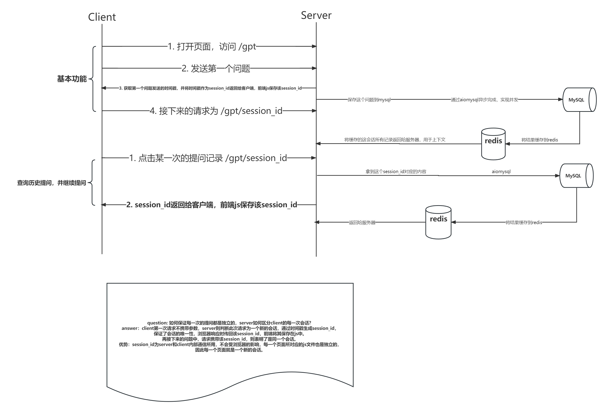

# gptplat

## 模块

- gptplat
    - gpt chat-gpt
    - auth 权限管理
    - manage 后台用户管理
    - common 公共函数

## gpt模块架构设计图

## auth设计

- wrappers 装饰器
    - login_required
    - permission_required

## 更新日志

1. 存入mysql的数据，以历史记录的方式可视化在前端，用户点击访问某一次的记录，可以继续那次的对话
2. 点击历史记录后，从mysql拿到那一次之前的所有消息并缓存在redis
3. sendBeacon() 为了避免chrome在onBeforeUnload事件中禁用fetch
4. mysql查询到的数据是tuple，redis不能用tuple、list，选用string，使用eval将string转化成list、tuple
5. 重构前端
6. 点击历史对话 -> 将mysql的数据缓存到redis。**最后同步缓存的时候，插入新增加的对话，并更新message的时间**
7. 修改了read_yaml的路径，将`\\`改成了`/`,否则linux识别不了
8. 修复了数据库已知问题
9. 优化了前端页面动态渲染和事件绑定的逻辑
10. 添加删除聊天的功能
11. 修复删除聊天功能的异常
12. 优化前端界面
13. 隐藏历史记录
14. 解决回车无法显示的问题（innerHTML还是innerText?）
15. 将temperature从0调整到0.6
16. 添加自定义异常，异常捕获功能
17. 添加权限管理模块
18. 重构代码结构, 添加Blueprint进行模块化编码
19. 新增索引表，用于绑定对话记录与用户
20. 隔离用户的历史会话信息
21. 添加后台用户管理crud的api
22. 添加api文档接口

## css总结

1. `word-wrap: break-word`,很多字母连在一起会被浏览器误认为是一个单词，而不会换行，因此需要设置此属性
2. `width: fit-content` 和 `maxWidth: 50%`实现div宽度的自适应
3. `clear: both`实现让设置了`float`的div可以独占一行

## mysql总结

1. `delete from message m where m.id = 1`这句话是错的，在mysql
   delete中应该这样使用别名：`delete m from message m where m.id = 1`